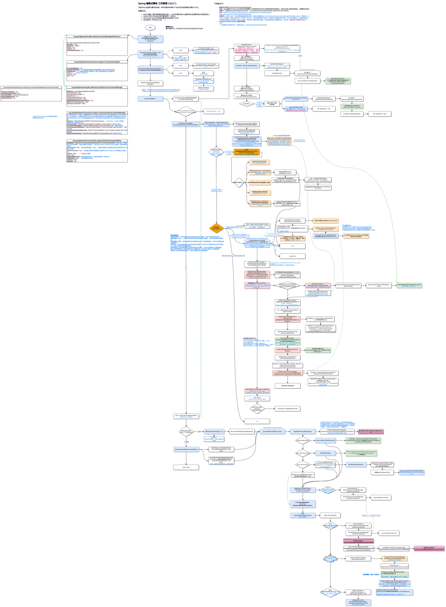

# Spring源码分析

+ Spring 常用模块原理分析

  - IOC
  - AOP
  - Context
  - Transaction
  - ... 
  
+ Spring MVC 原理分析

## Spring 基于注解IoC全流程 (AnnotationConfigApplicationContext) 

流程图较大，加载较慢！

## Spring 编程式事务全流程

