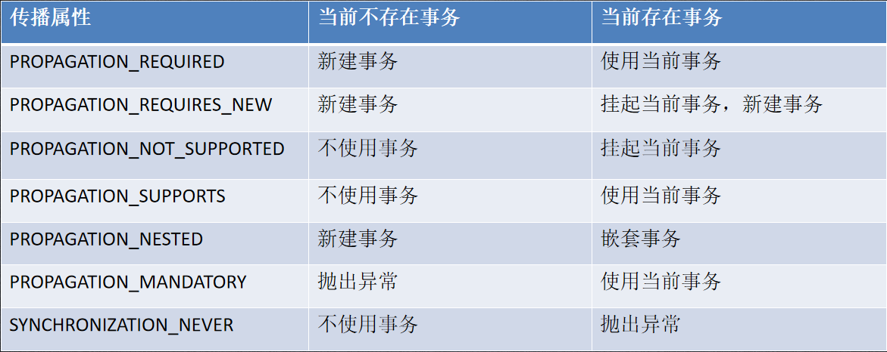

# Spring事务源码解析

Spring事务依赖于数据库事务实现。

## 数据库事务特性

+ 原子性

  事务必须完整执行，要么全部执行要么全部不执行。

+ 一致性

  事务执行后结果必须和事务操作预期一致。

+ 隔离性

  针对多个并发事务，防止多个事务并发执行时由于交叉执行导致数据不一致。

  包括四种隔离级别：读未提交(RU)、读已提交(RC)、可重复读(RR)、序列化。

+ 持久性

  事务对数据的修改是永久的，即使系统故障也不会丢失。

## 事务隔离级别

```shell
#查看mysql 的默认隔离级别
SELECT @@tx_isolation
#设置为读未提交
set tx_isolation='read-uncommitted';
#设置为读已提交
set tx_isolation='read-committed';
#设置为可重复读
set tx_isolation='REPEATABLE-READ';
#设置为串行化
set tx_isolation='SERIALIZABLE';
```


+ 脏读

+ 不可重复读

  事务A先读取一次数据，然后事务B修改了数据，事务Ａ又读取一次数据发现数据不一致。

+ 幻读

  事务A修改表中数据,此时事务B插入一条新数据,事务A查询发现表中还有没修改的数据,像是出现幻
  觉；事务A读到了事务B新增的数据,导致结果不一致, 侧重点在于事务B新增数据

## Spring 事务应用及源码分析

Spring 事务是在数据库事务的基础上进行封装扩展 其主要特性如下:

+ 支持原有的数据事务的隔离级别加入了事务传播的概念

  事务传播：

  定义了７中事务传播行为

+ 提供多个事务的合并或隔离的功能

+ 提供声明式事务，让业务代码与事务分离,事务变得更易用 (AOP)

### Spring事务应用

#### 编程式事务

`top.kwseeker.spring.transaction.tx.SpringTransactionExample`

#### 声明式事务

`top.kwseeker.spring.transaction.service.*`

@Transactional属性

| 属性名                 | 说明                                                         |
| ---------------------- | ------------------------------------------------------------ |
| transactionManager     | 当在配置文件中有多个 TransactionManager , 可以用该属性指定选择哪个事务管理器。 |
| propagation            | 事务的传播行为,默认值为 REQUIRED。                           |
| isolation              | 事务的隔离级别,默认值采用 DEFAULT，对于到MySQL是RR。         |
| timeout                | 事务的超时时间,默认值为-1。如果超过该时间限制但事务还没有完成,则自动回滚事务。 |
| readOnly               | 指定事务是否为只读事务,默认值为 false;为了忽略那些不需要事务的方法,比如读取数据,可以设置 readOnly 为 true。 |
| rollbackFor            | 用于指定能够触发事务回滚的异常类型,如果有多个异常类型需要指定,各类型之间可以通过逗号分隔。 |
| noRollbackFor          | 抛出 noRollbackFor 指定的异常类型,不回滚事务。               |
| rollbackForClassName   | 用于指定能够触发事务回滚的Class类型                          |
| noRollbackForClassName | 用于指定不触发事务回滚的Class类型                            |

### 事务实现原理

#### JDBC事务实现

为了方便理解整个架构思想，最好从最底层最简单的操作开始理解：JDBC transaction -> JDBCTemplate -> AOP -> Spring Transaction。

##### JDBC transaction

[JDBC Basic : Using Transactions](https://docs.oracle.com/javase/tutorial/jdbc/basics/transactions.html)

基本流程：

１）关闭自动提交（关于获取Connection连接，创建PrepareStatement这里不再赘述）`Connection$setAutoCommit(false)`；

２）执行事务中多个操作`PrepareStatement$executeUpdate()`; 其中可以设置保存点；

３）全部正常执行则直接提交`Connection$commit()`；

４）发生异常，捕获要处理的异常手动回退`Connection$rollback()`;

５）释放资源（`PrepareStatement$close();Connection$close()`），修改提交模式为原来的自动提交。

优化：

<u>由于业务和事务处理本来没什么关系（没有数据关联），所以这里很适合使用动态代理，实现解耦合和事务处理代码复用。另外还可以结合注解优化选择对哪些接口代理增强</u>

先回顾下动态代理的原理（这里只说CGLib）：

１）定义增强逻辑，就是指增加的功能，这里就是事务控制；

２）创建增强类`Enhancer`实例（类类型），相当于原有类的子类，组装原有逻辑与增强逻辑；

３）反射创建增强后的业务实例对象，执行业务。

测试源码：`top.kwseeker.jdbc.transaction.JdbcTransactionExample`

#### Spring事务实现

Spring事务原理和上面类似，只不过Spring基于AOP(则基于CGLib)和数据库事务(JdbcTemplate，封装JDBC)的实现，除此外还拓展了事务传播机制。

Spring事务使用IOC配置数据源、加载事务管理器、加载事务增强实现类[包括：指定增强实现、针对哪些方法进行增强]（以Bean的形式装载），不过这些不是重点，重点是事务管理器解析配置和增强类创建代理对象的过程。

**入口**：

```java
//1) 第一步骤还是解析xml配置或注解配置
//1.1) 解析配置，然后使用IOC装配，所有的框架解析这一步都是一样的，略过。
//TODO:至于xml命名空间的原理还要看一下
<tx:annotation-driven transaction-manager="txManager"/>
  TxNamespaceHandler$init()
    //定义了三个事务Bean定义解析器，doParse()方法将配置
    //解析xml格式增强类配置信息的解析器,即<tx:advice id="advice" transaction-manager="txManager"></tx:advice>里面定义的内容
    this.registerBeanDefinitionParser("advice", new TxAdviceBeanDefinitionParser());
    //解析注解格式增强类配置信息的解析器，即@Transactional注释的内容
	this.registerBeanDefinitionParser("annotation-driven", new AnnotationDrivenBeanDefinitionParser());
	//解析JTA分布式事务配置的解析器
    this.registerBeanDefinitionParser("jta-transaction-manager", new JtaTransactionManagerBeanDefinitionParser());  
//!!! 经过1.1)之后，xml以及注解中的配置都被放入到了一个TransactionInterceptor(事务拦截器)这么一个Bean实例中；
TransactionInterceptor
  //这个类真正实现存储上面的配置信息
  TransationAspectSupport
    //详细配置信息类
    private static final ThreadLocal<TransactionAspectSupport.TransactionInfo> transactionInfoHolder = new NamedThreadLocal("Current aspect-driven transaction");
    private String transactionManagerBeanName;
    private PlatformTransactionManager transactionManager;
    private TransactionAttributeSource transactionAttributeSource;
    private BeanFactory beanFactory;
    private final ConcurrentMap<Object, PlatformTransactionManager> transactionManagerCache = new ConcurrentReferenceHashMap(4);
  MethodInterceptor
      
//2) 生成代理服务对象 
//由于UserServiceImpl中方法注释有@Transactional(propagation = Propagation.REQUIRED)
//bean创建后，在初始化过程判断出来需要代理，于是使用这个bean又创建了代理对象覆盖了原来通过构造器创建的bean
//对于接口类代理使用JDK Proxy,对于没有实现接口的类代理使用CGLib.
JdkDynamicAopProxy$getProxy(@Nullable ClassLoader classLoader)
  Class<?>[] proxiedInterfaces = AopProxyUtils.completeProxiedInterfaces(this.advised, true);
  findDefinedEqualsAndHashCodeMethods(proxiedInterfaces);
  return Proxy.newProxyInstance(classLoader, proxiedInterfaces, this);

//3) 事务执行
JdkDynamicAopProxy$invoke(Object proxy, Method method, Object[] args)
  TransactionInterceptor$invoke(MethodInvocation invocation)
    TransactionAspectSupport$invokeWithinTransaction(Method method, @Nullable Class<?> targetClass, TransactionAspectSupport.InvocationCallback invocation)
      //开启事务
    　//通过事务管理器获取连接，设置自动提交为false
      TransactionAspectSupport.TransactionInfo txInfo = this.createTransactionIfNecessary(tm, txAttr, joinpointIdentification);
      try {
        //调用事务业务逻辑
        result = invocation.proceedWithInvocation();
      } catch (Throwable var17) {
        //出现异常回滚
        this.completeTransactionAfterThrowing(txInfo, var17);
        throw var17;
      } finally {
        //释放资源
        this.cleanupTransactionInfo(txInfo);
      }
　　　 //如果成功，提交
      this.commitTransactionAfterReturning(txInfo);
      return result;
    
//看到这里发现和上面自己写的真的挺类似的，不过spring事务还包含了很多细节的控制。
```

+ **TransactionInterceptor**

  + TransationAspectSupport
  + MethodInterceptor
+ TransactionDefinition
+ TransactionAttribute
+ PlatformTransactionManager
  + DataSourceTransactionManager
  + JtaTransactionManager
+ TransactionStatus

#### 事务失效分析

事务失效场景

+ **事务应用在非public方法上**

  `TransactionInterceptor` （事务拦截器）在目标方法执行前后进行拦截,`DynamicAdvisedInterceptor`（CglibAopProxy 的内部类）的 intercept 方法或 `JdkDynamicAopProxy` 的 invoke 方法会间接调用 `AbstractFallbackTransactionAttributeSource`的 `computeTransactionAttribute` 方法，获取Transactional 注解的事务配置信息。

  ```java
  protected TransactionAttribute computeTransactionAttribute(Method method,
      Class<?> targetClass) {
          // Don't allow no-public methods as required.
          if (allowPublicMethodsOnly() && !Modifier.isPublic(method.getModifiers())) {
          return null;
          }
  }
  ```

+ **数据库本身不支持事务**

  如果MySQL配置使用表锁，事务同样会失效（MySQL事务是针对行锁的）

+ **没有@Transactional的方法内部调用＠Transactial修饰的方法导致事务失效**

  以外部方法为准，即使内部调了一个@Transactional方法，但是生成代理类的时候并不会为外部方法添加事务控制增强。

  解决方法:

  1) 在没有@Transactional的方法上添加事务，然后另一个方法会使用当前方法的代理对象；

  2) 当前方法不加事务注解，手动获取当前类的代理对象，通过代理对象调用另一个方法。

+ **异常在事务方法中被捕获**

+ **配置不正确**

  + 标签`<tx:advice>`中切点配置不正确

  + 异常配置不正确

    比如配置rollbackFor针对某个异常才回滚，那么其他的异常事务都失效。

#### 事务传播机制



##### 事务传播实现原理

```java
TransactionInterceptor#invoke
  TransactionAspectSupport#invokeWithinTransaction
	//返回事务信息 TransactionInfo
    TransactionAspectSupport#createTransactionIfNecessary
	  //包含事务传播属性的逻辑
	  AbstractPlatformTransactionManager#getTransaction
  
public final TransactionStatus getTransaction(@Nullable TransactionDefinition definition) throws TransactionException {
    Object transaction = doGetTransaction();

    // Cache debug flag to avoid repeated checks.
    boolean debugEnabled = logger.isDebugEnabled();

    if (definition == null) {
        // Use defaults if no transaction definition given.
        definition = new DefaultTransactionDefinition();
    }

    if (isExistingTransaction(transaction)) {
        // Existing transaction found -> check propagation behavior to find out how to behave.
        return handleExistingTransaction(definition, transaction, debugEnabled);
    }

    // Check definition settings for new transaction.
    if (definition.getTimeout() < TransactionDefinition.TIMEOUT_DEFAULT) {
        throw new InvalidTimeoutException("Invalid transaction timeout", definition.getTimeout());
    }

    // No existing transaction found -> check propagation behavior to find out how to proceed.
    if (definition.getPropagationBehavior() == TransactionDefinition.PROPAGATION_MANDATORY) {
        throw new IllegalTransactionStateException(
            "No existing transaction found for transaction marked with propagation 'mandatory'");
    }
    else if (definition.getPropagationBehavior() == TransactionDefinition.PROPAGATION_REQUIRED ||
             definition.getPropagationBehavior() == TransactionDefinition.PROPAGATION_REQUIRES_NEW ||
             definition.getPropagationBehavior() == TransactionDefinition.PROPAGATION_NESTED) {
        SuspendedResourcesHolder suspendedResources = suspend(null);
        if (debugEnabled) {
            logger.debug("Creating new transaction with name [" + definition.getName() + "]: " + definition);
        }
        try {
            boolean newSynchronization = (getTransactionSynchronization() != SYNCHRONIZATION_NEVER);
            DefaultTransactionStatus status = newTransactionStatus(
                definition, transaction, true, newSynchronization, debugEnabled, suspendedResources);
            doBegin(transaction, definition);
            prepareSynchronization(status, definition);
            return status;
        }
        catch (RuntimeException | Error ex) {
            resume(null, suspendedResources);
            throw ex;
        }
    }
    else {
        // Create "empty" transaction: no actual transaction, but potentially synchronization.
        if (definition.getIsolationLevel() != TransactionDefinition.ISOLATION_DEFAULT && logger.isWarnEnabled()) {
            logger.warn("Custom isolation level specified but no actual transaction initiated; " +
                        "isolation level will effectively be ignored: " + definition);
        }
        boolean newSynchronization = (getTransactionSynchronization() == SYNCHRONIZATION_ALWAYS);
        return prepareTransactionStatus(definition, null, true, newSynchronization, debugEnabled, null);
    }
}
```

