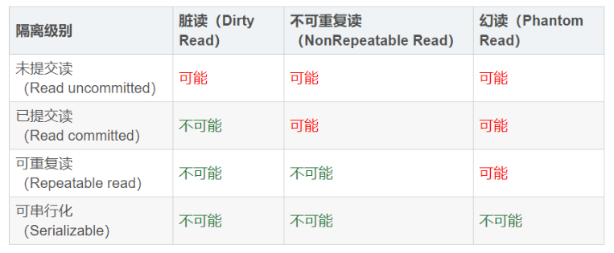

# Spring事务源码解析

Spring事务依赖于数据库事务实现。

## 数据库事务特性

+ 原子性

  事务必须完整执行，要么全部执行要么全部不执行。

+ 一致性

  事务执行后结果必须和事务操作预期一致。

+ 隔离性

  针对多个并发事务，防止多个事务并发执行时由于交叉执行导致数据不一致。

  包括四种隔离级别：读未提交(RU)、读已提交(RC)、可重复读(RR)、序列化。

+ 持久性

  事务对数据的修改是永久的，即使系统故障也不会丢失。

## 事务隔离级别

```shell
#查看mysql 的默认隔离级别
SELECT @@tx_isolation
#设置为读未提交
set tx_isolation='read-uncommitted';
#设置为读已提交
set tx_isolation='read-committed';
#设置为可重复读
set tx_isolation='REPEATABLE-READ';
#设置为串行化
set tx_isolation='SERIALIZABLE';
```



+ 脏读

+ 不可重复读

  事务A先读取一次数据，然后事务B修改了数据，事务Ａ又读取一次数据发现数据不一致。

+ 幻读

  事务A修改表中数据,此时事务B插入一条新数据,事务A查询发现表中还有没修改的数据,像是出现幻
  觉；事务A读到了事务B新增的数据,导致结果不一致, 侧重点在于事务B新增数据

## Spring 事务应用及源码分析

Spring 事务是在数据库事务的基础上进行封装扩展 其主要特性如下:

+ 支持原有的数据事务的隔离级别加入了事务传播的概念

  事务传播：

  定义了７中事务传播行为

+ 提供多个事务的合并或隔离的功能

+ 提供声明式事务，让业务代码与事务分离,事务变得更易用 (AOP)

### Spring事务接口

+ **TransactionDefinition**
  事务定义 : 定义事务的隔离级别和事务的传播行为

+ **TransactionAttribute**

  事务属性继承TransactionDefinition接口，扩展了回滚规则(处理异常,判断是否需要回滚)

+ **PlatformTransactionManager**
  事务管理器：提交事务、获取事务状态、回滚事务

  + DataSourceTransactionManager
  + JtaTransactionManager

+ **TransactionStatus**

  事务运行时状态

### Spring事务应用

#### 编程式事务

`top.kwseeker.spring.transaction.tx.SpringTransactionExample`

#### 声明式事务

`top.kwseeker.spring.transaction.service.*`

@Transactional属性

| 属性名                 | 说明                                                         |
| ---------------------- | ------------------------------------------------------------ |
| transactionManager     | 当在配置文件中有多个 TransactionManager , 可以用该属性指定选择哪个事务管理器。 |
| propagation            | 事务的传播行为,默认值为 REQUIRED。                           |
| isolation              | 事务的隔离级别,默认值采用 DEFAULT，对于到MySQL是RR。         |
| timeout                | 事务的超时时间,默认值为-1。如果超过该时间限制但事务还没有完成,则自动回滚事务。 |
| readOnly               | 指定事务是否为只读事务,默认值为 false;为了忽略那些不需要事务的方法,比如读取数据,可以设置 readOnly 为 true。 |
| rollbackFor            | 用于指定能够触发事务回滚的异常类型,如果有多个异常类型需要指定,各类型之间可以通过逗号分隔。 |
| noRollbackFor          | 抛出 noRollbackFor 指定的异常类型,不回滚事务。               |
| rollbackForClassName   | 用于指定能够触发事务回滚的Class类型                          |
| noRollbackForClassName | 用于指定不触发事务回滚的Class类型                            |

#### 事务实现原理

##### JDBC事务实现

为了方便理解整个架构思想，最好从最底层最简单的操作开始理解：JDBC transaction -> JDBCTemplate -> AOP -> Spring Transaction。

###### JDBC transaction

[JDBC Basic : Using Transactions](https://docs.oracle.com/javase/tutorial/jdbc/basics/transactions.html)

基本流程：

１）关闭自动提交（关于获取Connection连接，创建PrepareStatement这里不再赘述）`Connection$setAutoCommit(false)`；

２）执行事务中多个操作`PrepareStatement$executeUpdate()`; 其中可以设置保存点；

３）全部正常执行则直接提交`Connection$commit()`；

４）发生异常，捕获要处理的异常手动回退`Connection$rollback()`;

５）释放资源（`PrepareStatement$close();Connection$close()`），修改提交模式为原来的自动提交。

<u>由于业务和事务处理本来没什么关系（没有数据关联），所以这里很适合使用动态代理，实现解耦合和事务处理代码复用。另外还可以结合注解优化选择对哪些接口代理增强</u>

先回顾下动态代理的原理（这里只说CGLib）：

１）定义增强逻辑，就是指增加的功能，这里就是事务控制；

２）创建增强类`Enhancer`实例（类类型），相当于原有类的子类，组装原有逻辑与增强逻辑；

３）反射创建增强后的业务实例对象，执行业务。


Spring事务基于AOP和数据库事务的实现。


```java
<tx:annotation-driven transaction-manager="txManager"/>
  TxNamespaceHandler$init()
    this.registerBeanDefinitionParser("annotation-driven", new AnnotationDrivenBeanDefinitionParser());

//解析annotation-driven　BeanDefinition
AnnotationDrivenBeanDefinitionParser
```

+ **TransactionInterceptor**
+ 

#### 事务失效分析

事务失效场景

+ Bean不是代理对象

+ 入口函数不是public

+ 数据库不支持事务，如果MySQL配置使用表锁事务同样会失效（事务是针对行锁的）

+ 切点配置不正确

+ 内部方法调用导致事务失效

  执行事务操作的方法内部的this不是代理对象；可以配置 expose-proxy="true" ,就可以通过AopContext.currentProxy()获取。

+ 异常配置不正确

  比如配置rollbackFor针对某个异常才回滚，那么其他的异常事务都失效。

#### 事务传播机制

