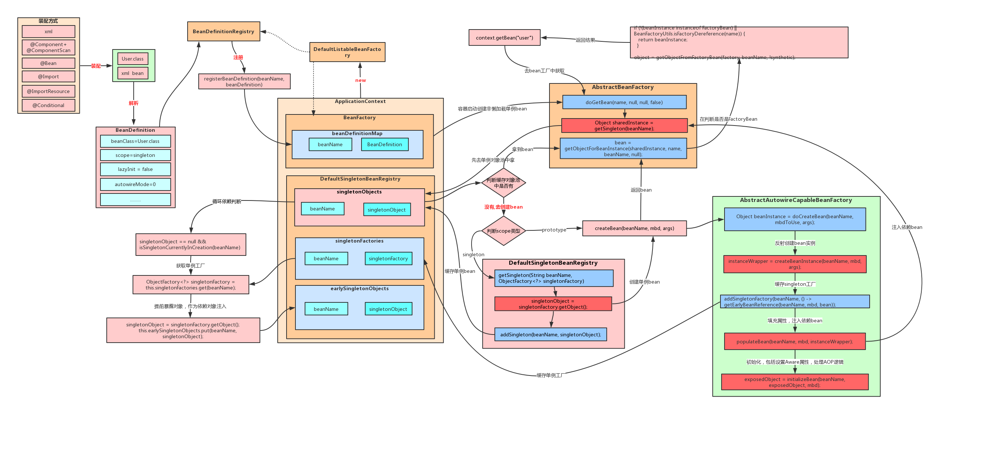
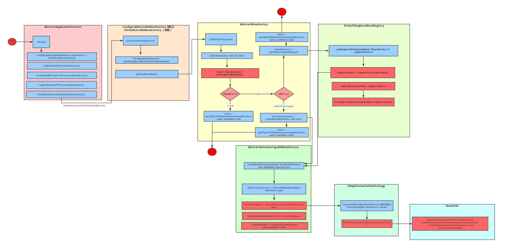
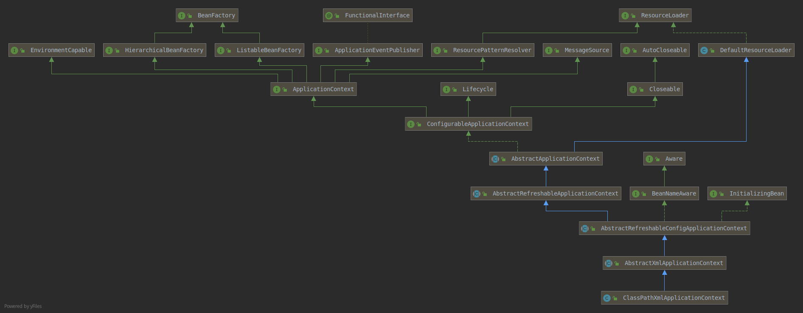

# Spring IOC 源码分析

只关心最核心的流程。以求以最简单的语言讲清楚原理。

## Spring IOC 核心流程

IOC把传统上由程序代码直接操控的对象的调用权交给容器，通过容器来实现对象组件的装配和管理。
DI（依赖注入）和DL(依赖查找)是IOC的两种实现方式。
Spring使用DI实现IOC;EJB使用DL实现IOC。

**总的来说分为三步**：  

首先Spring Bean容器既是XML、注解解析器，又是BeanDefinition容器，同时还是创建Bean的工厂。

<u>１）定义Bean,可以通过XML或注解的方式</u>  

​		其实就是通过<Bean>的标签或注解定义，比如name、class、scope、lazy-init、init-method、destroy-method等等。

<u>２）创建Bean容器（BeanFactory/ApplictionContext实现类）解析Bean定义（<beans>标签或注解注释的代码）到BeanDefinition容器（这里指Java容器，Bean容器里面有很多List、Set、Map容器，用于存储BeanDefinition）中</u>  

​		Bean容器中有BeanDefinitionReader实现类用于读取Bean定义，BeanDefinitionParser用于解析Bean定义（注入属性等操作）最终生成一个BeanDefinition对象。

​		Bean容器实现BeanDefinitionRegistry接口，通过注册方法将BeanDefinition注册到List、Set、Map等容器；

​		BeanDefinition中存储的就是xml标签或注解定义的属性；　

​		如果Bean有定义id属性（不为空）则以id为BeanName，如果id为空name标签不为空，AliasRegistry会使用name作为Bean的Name；

​		RootBeanDefinition是<bean>标签或@Bean注释的最顶层的Bean定义。

<u>３）从BeanDefinition容器获取Bean信息进行Bean实例化（构造器反射或工厂方法，另外还有一些初始化等等操作）</u>  



顶层常用的入口：
```java
//基于注解定义Bean
AnnotationConfigApplicationContext
//基于XML定义Bean
ClassPathXmlApplicationContext
//和上一种类似，只不过bean xml配置文件是通过操作系统文件相对路径或全路径定位的
FileSystemXmlApplicationContext
//Web应用基于XML定义Bean
XmlWebApplicationContext
//基于XML定义Bean(被废弃)
XmlBeanFactory
```

> 注意上面前四个顶层入口类并不是单单实现IOC的，IOC只是它实现的一部分工作，实际上是依靠的`AbstractApplicationContext`这个`BeanFactory`实现类的refresh()方法完成IOC的。  
> 而refresh()方法是通过组合的方式通过创建`DefaultListableBeanFactory`容器实现的。  


## Spring IOC 详细分析

### 从一个简单的测试开始

IOC Bean的构建流程:


#### 解析XML配置为BeanDefinition

选择ClassPathXmlApplicationContext进行分析：

xml文件内容：`spring-module/spring-ioc/src/main/resources／application.xml`。

测试代码：
```java
ApplicationContext context = new ClassPathXmlApplicationContext("application.xml");
JedisCluster jedisCluster = (JedisCluster) context.getBean("jedisCluster");
```
ClassPathXmlApplicationContext类图：


然后开始跟代码：  
```java
//new ClassPathXmlApplicationContext实例最后一步是执行refresh()方法
ClassPathXmlApplicationContext$refresh()
  //１）创建Bean容器，解析xml配置到BeanDefinition容器
  ConfigurableListableBeanFactory beanFactory = this.obtainFreshBeanFactory();  //AbstractApplicationContext$obtainFreshBeanFactory()
    this.refreshBeanFactory();
      //a)创建IoC容器(DefaultListableBeanFactory)
      DefaultListableBeanFactory beanFactory = this.createBeanFactory();
        return new DefaultListableBeanFactory(this.getInternalParentBeanFactory());
      beanFactory.setSerializationId(this.getId());
      this.customizeBeanFactory(beanFactory);
      //b)加载xml文件，解析内容注册到BeanDefinition IOC容器中 
      this.loadBeanDefinitions(beanFactory);	//AbastractRefreshableApplicationContext$loadBeanDefinitions()
        //创建Xml文件读取器
		XmlBeanDefinitionReader beanDefinitionReader = new XmlBeanDefinitionReader(beanFactory);
        this.initBeanDefinitionReader(beanDefinitionReader);
		//读取配置资源并加载配置
        this.loadBeanDefinitions(beanDefinitionReader);
		  Resource[] configResources = this.getConfigResources();
		  reader.loadBeanDefinitions(configResources);
 		  String[] configLocations = this.getConfigLocations();
		  reader.loadBeanDefinitions(configLocations);
		    loadBeanDefinitions(location);	//AbstractBeanDefinitionReader$loadBeanDefinitions() 这里面经历了好多层调用,只列举最重要的
              //从根节点开始解析Element,通过委托将内容存储到BeanDefinitionHolder
			  //根节点的解析被委托给了 BeanDefinitionParserDelegate, 包括标签解析等一系列解析操作都在这个类中完成，最后生成 BeanDefinitionHolder实例bdHolder中。
			  //如果想要看xml详细解析流程进入BeanDefinitionParserDelegate这个类查看
			  parseBeanDefinitions(root, this.delegate);	//DefaultBeanDefinitionDocumentReader$parseBeanDefinitions()
              BeanDefinitionReaderUtils.registerBeanDefinition(bdHolder, getReaderContext().getRegistry());
				registry.registerBeanDefinition(beanName, definitionHolder.getBeanDefinition());	//DefaultListableBeanFactory$registerBeanDefinition() !!!
　　　　　　　　　　　//如果有设置别名，将别名也保存到容器
　　　　　　　　　 registry.registerAlias(beanName, alias);
    ConfigurableListableBeanFactory beanFactory = this.getBeanFactory();
    return beanFactory;

  //２）准备Bean工厂：指定beanFacotry的类加载器，添加后置处理器、注册缺省环境bean等；
  // 	添加了两个后置处理器　ApplicationContextAwareProcessor, ApplicationListenerDetector
  this.prepareBeanFactory(beanFactory);
  try {
    //３）BeanFactory后置处理（TODO）
    this.postProcessBeanFactory(beanFactory);
    //４）调用BeanFactoryPostProcessor后置处理器对BeanDefinition处理
    this.invokeBeanFactoryPostProcessors(beanFactory);
    //５）注册BeanPostProcessor后置处理器
    this.registerBeanPostProcessors(beanFactory);
    //６）初始化一些消息源(比如处理国际化的i18n等消息源)
    this.initMessageSource();
    //７）初始化应用事件广播器
    this.initApplicationEventMulticaster();
    //８）初始化一些特殊的bean
    this.onRefresh();
    //９）注册一些监听器
    this.registerListeners();
    //10）实例化剩余的单例bean(非懒加载方式)
    // c)实例化Bean
    this.finishBeanFactoryInitialization(beanFactory);
    //11）完成刷新时,需要发布对应的事件
    this.finishRefresh();
  } catch (BeansException var9) {
    this.destroyBeans();
    this.cancelRefresh(var9);
    throw var9;
  } finally {
    this.resetCommonCaches();
  }
```

#### 解析注解配置为BeanDefinition

其实和xml配置的解析类似。

以`top.kwseeker.spring.ioc.annotation.config.MultiConfigurationExampleTest`作为测试代码跟进。

```java
AnnotationConfigApplicationContext(Class<?>... annotatedClasses)
  //1)创建Bean容器，DefaulatLitableBeanFactory
  AnnotationConfigApplicationContext()
    //super()调用父类无参构造器创建DefaultListableBeanFactory
    this.beanFactory = new DefaultListableBeanFactory();
    this.reader = new AnnotatedBeanDefinitionReader(this);
	  //注册多个注解处理器(BeanDefinition)：
      //0 = "org.springframework.context.annotation.internalConfigurationAnnotationProcessor"
	  //1 = "org.springframework.context.annotation.internalAutowiredAnnotationProcessor"
	　//2 = "org.springframework.context.annotation.internalRequiredAnnotationProcessor"
	　//3 = "org.springframework.context.annotation.internalCommonAnnotationProcessor"
	  //4 = "org.springframework.context.event.internalEventListenerProcessor"
	  //5 = "org.springframework.context.event.internalEventListenerFactory"
	  AnnotationConfigUtils.registerAnnotationConfigProcessors(this.registry);
		//ConfigurationClassPostProcessor
		def = new RootBeanDefinition(ConfigurationClassPostProcessor.class);
        def.setSource(source);
		beanDefs.add(registerPostProcessor(registry, def, "org.springframework.context.annotation.internalConfigurationAnnotationProcessor"));
		//...
    this.scanner = new ClassPathBeanDefinitionScanner(this);
  //2)解析配置类为BeanDefinition并将BeanDefinition,并将BeanDefinition注册到容器
  this.register(annotatedClasses);
	this.reader.register(annotatedClasses);
	  //AnnotationConfigApplicationContext(Class<?>... annotatedClasses)可以传入多个配置类，一一解析里面定义的Bean并注册。
	  for{
        this.registerBean(annotatedClass);
          //!!! 真正解析配置类的逻辑实现
          //但是这里并不是完全将配置类解析完毕了,只是解析并注册了配置类本身的BeanDefinition;
          //这个配置类的@Import注解和内部＠Bean注解都还没解析，这些内容的解析是在后置处理器中解析的。
          //this.reader.register()完成之后，结果只会看到新增了一个Bean: multiConfigurationExample。
          //想查看这步完成后的结果可以在AnnotationConfigApplicationContext$refresh()方法加断点，
          //然后调用this.getBeanNames() this.getBeanDefinition("multiConfigurationExample")查看
          this.doRegisterBean(annotatedClass, (Supplier)null, (String)null, (Class[])null);
            AnnotatedGenericBeanDefinition abd = new AnnotatedGenericBeanDefinition(annotatedClass);
            abd.setScope(scopeMetadata.getScopeName());
            AnnotationConfigUtils.processCommonDefinitionAnnotations(abd);
          　for{
              if (Primary.class == qualifier) {
                 abd.setPrimary(true);
              } else if (Lazy.class == qualifier) {
                 abd.setLazyInit(true);
              } else {
                 abd.addQualifier(new AutowireCandidateQualifier(qualifier));
              }   
            }
            for{
              customizer.customize(abd);
            }
            definitionHolder = AnnotationConfigUtils.applyScopedProxyMode(scopeMetadata, definitionHolder, this.registry);
            //将解析的BeanDefinition注册到BeanDefintion容器，看下一小节分析。
            BeanDefinitionReaderUtils.registerBeanDefinition(definitionHolder, this.registry);
      }

  //3) 这个refresh()方法和上面小节分析解析XML配置时的refresh()一样。
  this.refresh();  //AbastractApplicationContext$refresh()
	//初始化属性源和环境属性
	this.prepareRefresh();
    //只不过和xml解析是走的不同的逻辑
    ConfigurableListableBeanFactory beanFactory = this.obtainFreshBeanFactory();
	  //走的GenericApplicationContext$refreshBeanFactory()和解析xml的这一步有很大不同
	　//只是cas判断下是否已经refreshed,然后设置下序列化id.
	  this.refreshBeanFactory();  //GenericApplicationContext$refreshBeanFactory()
 		this.beanFactory.setSerializationId(this.getId());
      //直接返回之前已经创建号的beanFactory
      ConfigurableListableBeanFactory beanFactory = this.getBeanFactory();
	
 	//２）准备Bean工厂：指定beanFacotry的类加载器，添加后置处理器、注册缺省环境bean等；
	// 	添加了两个后置处理器　ApplicationContextAwareProcessor, ApplicationListenerDetector
    this.prepareBeanFactory(beanFactory);
    try {
      //３）BeanFactory后置处理（TODO）
      //	解析注解时是空方法
      this.postProcessBeanFactory(beanFactory);
      //４）!!! 调用BeanFactoryPostProcessor后置处理器对之前加载的配置类的内部内容进行解析
      //通过beanFactory.getBean()拿到ConfigurationClassPostProcessor（这个后置处理器，就是解析配置类内部的Bean等等内容的）
      //!!! 通过ConfigurationClassPostProcessor$postProcessBeanDefinitionRegistry(),注册所有注解配置的bean,注册顺序：@ComponentScan > ImportSelector > 方法bean > @ImportResource("spring.xml")
      //通过ConfigurationClassPostProcessor$postProcessBeanDefinitionFactory()增强@Configuration修饰的配置类，比如处理内部方法bean的依赖防止多例
      this.invokeBeanFactoryPostProcessors(beanFactory);
        //
        PostProcessorRegistrationDelegate.invokeBeanFactoryPostProcessors(beanFactory, this.getBeanFactoryPostProcessors());
          //获取刚开始注册的beanName为 internalConfigurationAnnotationProcessor实例
          currentRegistryProcessors.add(beanFactory.getBean(ppName, BeanDefinitionRegistryPostProcessor.class));
          //!!! 调用名为 internalConfigurationAnnotationProcessor的ConfigurationClassPostProcessor
          invokeBeanDefinitionRegistryPostProcessors(currentRegistryProcessors, registry);
            postProcessor.postProcessBeanDefinitionRegistry(registry);  //ConfigurationClassPostProcessor$postProcessBeanDefinitionRegistry()
        	  //>>>>>>>>>>>>>>>>>>>>>>>>
        	  //!!! 这里开始解析配置类内部的Bean并注册到BeanDefinition容器
        	  this.processConfigBeanDefinitions(registry);
        		//配置了@Configuration这时Full类型，@Component@ComponentScan@Import@ImportResour@Bean是Lite类型
        		if (!ConfigurationClassUtils.isFullConfigurationClass(beanDef) && !ConfigurationClassUtils.isLiteConfigurationClass(beanDef)) {
         		  //待详细解析的配置类的列表,此处测试只有"multiConfigurationExampleTest"这个配置类
        		  configCandidates.add(new BeanDefinitionHolder(beanDef, beanName));
                }
        		//应该是根据@Order注解值排序
        		configCandidates.sort((bd1, bd2) -> {
                    int i1 = ConfigurationClassUtils.getOrder(bd1.getBeanDefinition());
                    int i2 = ConfigurationClassUtils.getOrder(bd2.getBeanDefinition());
                    return Integer.compare(i1, i2);
                });
        		//创建解析器
        		ConfigurationClassParser parser = new ConfigurationClassParser(this.metadataReaderFactory, this.problemReporter, this.environment, this.resourceLoader, this.componentScanBeanNameGenerator, registry);
        		//逐个解析配置类
				while {
                  //
                  parser.parse(candidates);
                    //经过多层调用进入到ConfigurationClassParser$processConfigurationClass()
                    //递归处理配置类及其父类层次结构的配置,将配置解析到ConfigurationClass这个类中
                    sourceClass = this.doProcessConfigurationClass(configClass, sourceClass);
                      //
                      this.processMemberClasses(configClass, sourceClass);
                      //解析是否注释@ComponentScans @ComponentScan,是的化，执行扫描处理
                      Set<AnnotationAttributes> componentScans = AnnotationConfigUtils.attributesForRepeatable(sourceClass.getMetadata(), ComponentScans.class, ComponentScan.class);
                   	  ...
                      //解析并处理@Import注解,详细分析在后面讲重要细节实现原理时深入分析
                      this.processImports(configClass, sourceClass, this.getImports(sourceClass), true);
        			  importResource = AnnotationConfigUtils.attributesFor(sourceClass.getMetadata(), ImportResource.class);
                      ...
                      //解析处理@Bean方法
                      Set<MethodMetadata> beanMethods = this.retrieveBeanMethodMetadata(sourceClass);
        			  Iterator var17 = beanMethods.iterator();
                    　...
                  this.reader = new ConfigurationClassBeanDefinitionReader(registry, this.sourceExtractor, this.resourceLoader, this.environment, this.importBeanNameGenerator, parser.getImportRegistry());
				  this.reader.loadBeanDefinitions(configClasses);
                }
        		//
        		sbr.registerSingleton(IMPORT_REGISTRY_BEAN_NAME, parser.getImportRegistry());
      	  //后面还有多次调用（TODO）
          invokeBeanDefinitionRegistryPostProcessors(currentRegistryProcessors, registry);
          
      //５）注册BeanPostProcessor后置处理器
      this.registerBeanPostProcessors(beanFactory);
        
      //６）初始化一些消息源(比如处理国际化的i18n等消息源)
      this.initMessageSource();
      //７）初始化应用事件广播器
      this.initApplicationEventMulticaster();
      //８）初始化一些特殊的bean
      this.onRefresh();
      //９）注册一些监听器
      this.registerListeners();
        
      //10）实例化剩余的单例bean(非懒加载方式)
      // c)实例化Bean
      this.finishBeanFactoryInitialization(beanFactory);
      //11）完成刷新时,需要发布对应的事件
      this.finishRefresh();
    } catch (BeansException var9) {
      this.destroyBeans();
      this.cancelRefresh(var9);
      throw var9;
    } finally {
      this.resetCommonCaches();
    }
```

#### 注册BeanDefinition到BeanDefinition容器

承接上一步`DefaultListableBeanFactory$registerBeanDefinition() `。

```java
DefaultListableBeanFactory$registerBeanDefinition
  //首先查看BeanDefinition容器中是否已经存在此beanName的BeanDefinition
  oldBeanDefinition = this.beanDefinitionMap.get(beanName);
  //将beanName和beanDefinition映射保存到集合
  this.beanDefinitionMap.put(beanName, beanDefinition);
  this.beanDefinitionNames.add(beanName);
  this.manualSingletonNames.remove(beanName);
```

#### Bean实例化流程

实例化流程入口：  
```java
ClassPathXmlApplicationContext$refresh()
  //10）实例化剩余的单例bean(非懒加载方式),Bean的IoC、DI和AOP都是发生在此步骤
  this.finishBeanFactoryInitialization(beanFactory);  //AbstractApplicationContext$finishBeanFactoryInitialization()
    beanFactory.preInstantiateSingletons();   //DefaultListableBeanFactory$preInstantiateSingletons()
      //获取之前注册到BeanDefinition容器中的bean的名字集合
      List<String> beanNames = new ArrayList(this.beanDefinitionNames);
      //依次获取bean名字,然后依次判断：
      while(true) {
        //这个bean是不是抽象类，对应 <bean> abstract属性
        //生命周期是不是非单例　scope　
        //是不是懒加载 lazy-init
        //只有不满足上面三个情况，才会执行getBean
====>   this.getBean(beanName);   //AbastractBeanFactory$getBean()
          return this.doGetBean(name, (Class)null, (Object[])null, false);  //AbastractBeanFactory$doGetBean()
            //先从单例对象池中以beanName(<bean>标签id属性)为key查找对象，有的话说明对象已经创建过，直接返回
            Object sharedInstance = this.getSingleton(beanName);
            //scope singleton 对象池没有则走创建流程
            //先记录一下这个bean到Set<String> alreadyCreated
            this.markBeanAsCreated(beanName);
            //获取根BeanDefinition
            final RootBeanDefinition mbd = getMergedLocalBeanDefinition(beanName);
            //检查是不是抽象类
            this.checkMergedBeanDefinition(mbd, beanName, args);
            //查看依赖,
            String[] dependsOn = mbd.getDependsOn();
            //如果有依赖bean,则先实例化依赖bean
            for {
              this.getBean(dep);
            }
            //依赖实例化完成后，根据scope类型创建bean实例
            //singleton
            sharedInstance = this.getSingleton()    //DefaultSingletonBeanRegistry$getSingleton()
              this.createBean(beanName, mbd, args); //AbstractAutowireCapableBeanFactory$createBean()
                //加载类
                Class<?> resolvedClass = this.resolveBeanClass(mbd, beanName, new Class[0]);
                  Class<?> resolvedClass = ClassUtils.forName(className, classLoader);
                //创建bean实例
                beanInstance = this.doCreateBean(beanName, mbdToUse, args); 
                  instanceWrapper = this.createBeanInstance(beanName, mbd, args);
                    return ctors == null && mbd.getResolvedAutowireMode() != 3 && !mbd.hasConstructorArgumentValues() && ObjectUtils.isEmpty(args) ? this.instantiateBean(beanName, mbd) : this.autowireConstructor(beanName, mbd, ctors, args);        
                      //获取bean实例化策略（singleton的话是SimpleInstantiationStrategy，这个策略其实是反射）
                      beanInstance = this.getInstantiationStrategy().instantiate(mbd, beanName, this);
                        //反射构造实例
                        Class<?> clazz = bd.getBeanClass();
                        constructorToUse = clazz.getDeclaredConstructor();
                        BeanUtils.instantiateClass(constructorToUse, new Object[0]);                          
                          return KotlinDetector.isKotlinType(ctor.getDeclaringClass()) ? BeanUtils.KotlinDelegate.instantiateClass(ctor, args) : ctor.newInstance(args);  //BeanUtils.instantiateClass()
                            ctor.newInstance(args);
                  //填充bean属性,即bean实例被创建后，为实例成员变量赋值
                  this.populateBean(beanName, mbd, instanceWrapper);
                  //初始化bean，包括设置Aware属性，处理AOP逻辑
                  exposedObject = this.initializeBean(beanName, exposedObject, mbd);                   //如果bean实现Aware接口，则调用Aware实现类接口，下面细节分析具体讲这部分内容
                    this.invokeAwareMethods(beanName, bean);
                    //初始化前调用后置处理器
                    wrappedBean = this.applyBeanPostProcessorsBeforeInitialization(bean, beanName);
                    //
                    this.invokeInitMethods(beanName, wrappedBean, mbd);
                    //
                    wrappedBean = this.applyBeanPostProcessorsAfterInitialization(wrappedBean, beanName);
            //prototype
            this.beforePrototypeCreation(beanName);
            prototypeInstance = this.createBean(beanName, mbd, args);
            this.afterPrototypeCreation(beanName);
            //other scope
            Object scopedInstance = scope.get(beanName, () -> {
              this.beforePrototypeCreation(beanName);
              var4 = this.createBean(beanName, mbd, args);
              this.afterPrototypeCreation(beanName);
            });
            bean = this.getObjectForBeanInstance(scopedInstance, name, beanName, mbd);
      }
```

#### Bean销毁流程

```java
AbstractApplicationContext$close()
  this.doClose();
  	LiveBeansView.unregisterApplicationContext(this);
  	this.publishEvent((ApplicationEvent)(new ContextClosedEvent(this)));
  	//销毁Bean
  	this.destroyBeans();
	  //
	  this.getBeanFactory().destroySingletons();
    this.closeBeanFactory();
    this.onClose();
```


### IOC中重要细节的原理

#### 从XML或注解解析时获取beanName的原理

是在解析完成后注册BeanDefinition到容器前实现。

```java
BeanDefinitionParserDelegate$parseBeanDefinitionElement()
  String id = ele.getAttribute(ID_ATTRIBUTE);
  String nameAttr = ele.getAttribute(NAME_ATTRIBUTE);
  List<String> aliases = new ArrayList<>();
  if (StringUtils.hasLength(nameAttr)) {
    String[] nameArr = StringUtils.tokenizeToStringArray(nameAttr, MULTI_VALUE_ATTRIBUTE_DELIMITERS);
    aliases.addAll(Arrays.asList(nameArr));
  }
  String beanName = id;
  if (!StringUtils.hasText(beanName) && !aliases.isEmpty()) {
    beanName = aliases.remove(0);
  }
BeanDefinitionReaderUtils$registerBeanDefinition()
  String beanName = definitionHolder.getBeanName();
```

即默认以id作为beanName,如果id为空且有设置name标签（多个name以,;空格分割），则以第一个name作为beanName。


#### Bean实例化方式

重点关注`AbstractAutowireCapableBeanFactory$createBeanInstance()`：
```java
protected BeanWrapper createBeanInstance(String beanName, RootBeanDefinition mbd, @Nullable Object[] args) {
    Class<?> beanClass = this.resolveBeanClass(mbd, beanName, new Class[0]);
    if (beanClass != null && !Modifier.isPublic(beanClass.getModifiers()) && !mbd.isNonPublicAccessAllowed()) {
        throw new BeanCreationException(mbd.getResourceDescription(), beanName, "Bean class isn't public, and non-public access not allowed: " + beanClass.getName());
    } else {
        Supplier<?> instanceSupplier = mbd.getInstanceSupplier();
        if (instanceSupplier != null) {
            return this.obtainFromSupplier(instanceSupplier, beanName);
        } else if (mbd.getFactoryMethodName() != null) {  //factory-method
            //工厂方法构造bean
            return this.instantiateUsingFactoryMethod(beanName, mbd, args);
              //详细实现参考ConstructorResolver$instantiateUsingFactoryMethod()
              if (factoryBeanName != null) {  //实例工厂方法初始化bean
                String factoryBeanName = mbd.getFactoryBeanName();
                //获取FactoryBean
                factoryBean = this.beanFactory.getBean(factoryBeanName);
                factoryClass = factoryBean.getClass();
              }　else {       //静态工厂方法实例化Bean
                factoryClass = factoryClass = mbd.getBeanClass();
              }
              beanInstance = this.beanFactory.getInstantiationStrategy().instantiate(mbd, beanName, this.beanFactory, factoryBean, factoryMethodToUse, argsToUse);
        } else {
            boolean resolved = false;
            boolean autowireNecessary = false;
            if (args == null) { //构造器参数
                synchronized(mbd.constructorArgumentLock) {
                    if (mbd.resolvedConstructorOrFactoryMethod != null) {
                        resolved = true;
                        autowireNecessary = mbd.constructorArgumentsResolved;
                    }
                }
            }
            if (resolved) {
                return autowireNecessary ? this.autowireConstructor(beanName, mbd, (Constructor[])null, (Object[])null) : this.instantiateBean(beanName, mbd);
            } else {
                Constructor<?>[] ctors = this.determineConstructorsFromBeanPostProcessors(beanClass, beanName);
                //构造器反射实例化Bean
                return ctors == null && mbd.getResolvedAutowireMode() != 3 && !mbd.hasConstructorArgumentValues() && ObjectUtils.isEmpty(args) ? this.instantiateBean(beanName, mbd) : this.autowireConstructor(beanName, mbd, ctors, args);
            }
        }
    }
}
```

+ 构造器＋反射（大部分都是这种方式）

+ FactoryMethod

  - 静态工厂方法

  - 实例工厂方法

```xml
<!--使用无参构造器＋反射构造-->
<bean id = "arvin" class="top.kwseeker.spring.ioc.entity.User" init-method="init" destroy-method="close"/>
<!--使用工厂方法构造Bob，首先需要有工厂bean实例，BeanFactory是spring中构造Bean的接口，FactoryBean只是个Bean不过这个Bean是用于创建其他对象的工厂模式-->
<bean id = "userFactory" class="top.kwseeker.spring.ioc.entity.UserFactory"/>
<bean id = "bob" factory-bean="userFactory" factory-method="createUser" />
<!--静态工厂方法构造对象-->
<bean id = "cindy" class="top.kwseeker.spring.ioc.entity.StaticUserFactory" factory-method="createUser"/>
```

#### 依赖注入的三种实现具体原理

依赖注入就是给类对象成员变量设置注入规则然后自动赋值。  
赋值的方式有构造方法和setter方法。  

+ 构造注入

  ```xml
  <!-- 使用构造函数的方式,给 service 中的属性传值要求:类中需要提供一个对应参数列表的构造函数。
  涉及的标签:constructor-arg
  * index:指定参数在构造函数参数列表的索引位置
  * name:指定参数在构造函数中的名称
  * value:它能赋的值是基本数据类型和 String 类型
  * ref:它能赋的值是其他 bean 类型,也就是说,必须得是在配置文件中配置过的 bean
  --!>
  <bean id="david" class="top.kwseeker.spring.ioc.entity.User">
      <constructor-arg name="username" value="david"/>
      <constructor-arg name="age" value="25"/>
  </bean>
  ```

+ setter注入（设值注入）

  - 手动装配

    ```xml
    <!--２ setter注入(手动注入，自动注入使用＠Autowired @Resource @Inject)-->
    <bean id="erik" class="top.kwseeker.spring.ioc.entity.User">
        <property name="username" value="erik"/>
        <property name="age" value="24"/>
    </bean>
    ```

  - 自动装配
    - @Autowired:  
      作用一:查找实例,从spring容器中根据Bean的类型(byType)获取实例。如果一个类有多个实例，需要结合＠Qualifier通过名字选择注入。  
      作用二:赋值,将找到的实例,装配给另一个实例的属性值。  
      注意事项:一个java类型在同一个spring容器中,只能有一个实例  
      @Autowired 默认情况下要求依赖对象必须存在 ,如果需要允许null值,可以设置它的required属性为false,如:@Autowired(required=false)。
    - @Resource:  
      作用一:查找实例,从spring容器中根据Bean的名称(byName)获取实例。  
      作用二:赋值,将找到的实例,装配给另一个实例的属性值。  
    - @Inject:  
      @Inject是根据类型进行自动装配的,如果需要按名称进行装配,则需要配合 @Named ;
      @Inject是JSR330中的规范,需要导入javax.inject.Inject;实现注入。  
      @Inject可以作用在变量、setter方法、构造函数上。

+ 接口注入

  感觉就是setter注入；写法没有什么不同。
  ```xml
  <!-- Program是Job的实现类 -->
  <bean id="program" class="top.kwseeker.spring.ioc.entity.Pragram"/>
  <bean id="frank" class="top.kwseeker.spring.ioc.entity.User">
      <property name="job" ref="program"/>
  </bean>
  ```

##### 依赖注入类型

简单类型用`value`指定，对象类型用`ref`, 集合类型用`list`、`set`、`map`、`props`。

##### 源码解析

依赖注入发生在Bean属性装配阶段：

`AbastractAutowireCapableBeanFactory$populateBean()`。

目标是研究依赖注入方式的选择（constructor,  setter, 反射?），依赖查找方式的选择(byName, byType?);

使用@Autowired注解又是怎么处理的？

```java
protected void populateBean(String beanName, RootBeanDefinition mbd, @Nullable BeanWrapper bw) {
   	
    // Give any InstantiationAwareBeanPostProcessors the opportunity to modify the
    // state of the bean before properties are set. This can be used, for example,
    // to support styles of field injection.
    boolean continueWithPropertyPopulation = true;

    if (!mbd.isSynthetic() && hasInstantiationAwareBeanPostProcessors()) {
        for (BeanPostProcessor bp : getBeanPostProcessors()) {
            if (bp instanceof InstantiationAwareBeanPostProcessor) {
                InstantiationAwareBeanPostProcessor ibp = (InstantiationAwareBeanPostProcessor) bp;
                if (!ibp.postProcessAfterInstantiation(bw.getWrappedInstance(), beanName)) {
                    continueWithPropertyPopulation = false;
                    break;
                }
            }
        }
    }

    if (!continueWithPropertyPopulation) {
        return;
    }

    PropertyValues pvs = (mbd.hasPropertyValues() ? mbd.getPropertyValues() : null);

    if (mbd.getResolvedAutowireMode() == RootBeanDefinition.AUTOWIRE_BY_NAME ||
        mbd.getResolvedAutowireMode() == RootBeanDefinition.AUTOWIRE_BY_TYPE) {
        MutablePropertyValues newPvs = new MutablePropertyValues(pvs);

        // Add property values based on autowire by name if applicable.
        if (mbd.getResolvedAutowireMode() == RootBeanDefinition.AUTOWIRE_BY_NAME) {
            autowireByName(beanName, mbd, bw, newPvs);
        }

        // Add property values based on autowire by type if applicable.
        if (mbd.getResolvedAutowireMode() == RootBeanDefinition.AUTOWIRE_BY_TYPE) {
            autowireByType(beanName, mbd, bw, newPvs);
        }

        pvs = newPvs;
    }

    boolean hasInstAwareBpps = hasInstantiationAwareBeanPostProcessors();
    boolean needsDepCheck = (mbd.getDependencyCheck() != RootBeanDefinition.DEPENDENCY_CHECK_NONE);

    if (hasInstAwareBpps || needsDepCheck) {
        if (pvs == null) {
            pvs = mbd.getPropertyValues();
        }
        PropertyDescriptor[] filteredPds = filterPropertyDescriptorsForDependencyCheck(bw, mbd.allowCaching);
        if (hasInstAwareBpps) {
            for (BeanPostProcessor bp : getBeanPostProcessors()) {
                if (bp instanceof InstantiationAwareBeanPostProcessor) {
                    InstantiationAwareBeanPostProcessor ibp = (InstantiationAwareBeanPostProcessor) bp;
                    pvs = ibp.postProcessPropertyValues(pvs, filteredPds, bw.getWrappedInstance(), beanName);
                    if (pvs == null) {
                        return;
                    }
                }
            }
        }
        if (needsDepCheck) {
            checkDependencies(beanName, mbd, filteredPds, pvs);
        }
    }

    if (pvs != null) {
        applyPropertyValues(beanName, mbd, bw, pvs);
    }
}
```


+ 构造器注入和setter手动注入实现原理

+ @Autowired @Resource自动装配实现原理

  自动装配的５种模式：no、byName、byType、constructor、autodetect。

  开启注解的自动装配：
  ```
  <beans>
    <context:annotation-config />
  </beans>
  <!-- 或 -->
  <beans>
    <bean class="org.springframework.beans.factory.annotation.AutowiredAnnotationBeanPostProcessor"/>
  </beans>
  ```
  
  

#### 常用注解实现原理

+ @ComponentScan

+ @Bean

+ @PostConstruct @PreDestroy

  相当于：
  ```
  <bean init-method="" destroy-method="" />
  ```
  
+ **@Configuration**

  [Basic Concepts: @Bean and @Configuration](https://docs.spring.io/spring/docs/current/spring-framework-reference/core.html#beans-java-basic-concepts)

  > Annotating a class with @Configuration indicates that its primary purpose is as a source of bean definitions. Furthermore, @Configuration classes let inter-bean dependencies be defined by calling other @Bean methods in the same class.  
  > 意味着＠Configuration修饰的类作为Bean的源，可以让内部其他Bean依赖当前Bean,避免一个类生成多个实例。  
  > 原理其实就是使用＠Configuration处理Bean依赖的时候会先去Bean单例池中查找依赖类型的Bean实例。这是通过CGLib重写了依赖处理逻辑，从而增加了从Bean单例池中查找依赖Bean实例这一步骤。

  测试代码：
  `top.kwseeker.spring.ioc.annotation.config.ConfigurationAnnotationTest`

  源码实现分析：  
  `ConfigurationClassPostProcessor`

  

+ **@Import**

  [Using the @Import Annotation](https://docs.spring.io/spring/docs/current/spring-framework-reference/core.html#beans-java-using-import)

  可以导入其他＠Configuration配置源中定义的BeanDefinitions；  
  但不仅仅限于导入＠Configuration配置源，还支持通过实现ImportSelector、ImportBeanDefinitionRegistrar接口自定义导入规则（多用于Spring整合第三方框架）。

  还有个相关的注解@ImportResource，可以注入xml文件中定义的Bean。

  如果当前配置源依赖另一个配置源的Bean,可以通过＠Autowired自动导入。

  测试代码：
  `top.kwseeker.spring.ioc.annotation.config.MultiConfigurationExampleTest`

  源码实现：

  `ConfigurationClassParser$doProcessConfigurationClass()`

  ```java
  //未完成，待续...
  ConfigurationClassParser$doProcessConfigurationClass()
    //解析@Import注解
    this.processImports(configClass, sourceClass, this.getImports(sourceClass), true);
  	//从注解中读取所有配置源
  	//0 = {ConfigurationClassParser$SourceClass@1761} "top.kwseeker.spring.ioc.annotation.config.ConfigurationAnnotationExample"
      //1 = {ConfigurationClassParser$SourceClass@1762} "top.kwseeker.spring.ioc.annotation.config.MyImportBeanDefinitionRegistrar"
  	//2 = {ConfigurationClassParser$SourceClass@1763} "top.kwseeker.spring.ioc.annotation.config.MyImportSelector"
  	this.collectImports(sourceClass, imports, visited);
  	  Iterator var4 = sourceClass.getAnnotations().iterator();
  	  while{
          this.collectImports(annotation, imports, visited);
        }
  	  imports.addAll(sourceClass.getAnnotationAttributes(Import.class.getName(), "value"));
  	
    importResource = AnnotationConfigUtils.attributesFor(sourceClass.getMetadata(), ImportResource.class);
    if (importResource != null) {
      String[] resources = importResource.getStringArray("locations");
      Class<? extends BeanDefinitionReader> readerClass = importResource.getClass("reader");
      String[] var19 = resources;
      int var21 = resources.length;
  
      for(int var22 = 0; var22 < var21; ++var22) {
          String resource = var19[var22];
          String resolvedResource = this.environment.resolveRequiredPlaceholders(resource);
          configClass.addImportedResource(resolvedResource, readerClass);
      }
    }
  ```

  

  

+ **@Conditional**

  定义Bean装载的条件，多用于Spring整合第三方框架，starter中大量运用了此注解。

  比如定义某个Bean装载完成后才能装载另外一个Bean。

  那么有个问题：如果想要Bean按＠Conditional条件顺序装载应该怎么实现？将作为条件的Bean放在前面测试好像是可以的，但总感觉不靠谱。TODO: 看第三方框架的starter是怎么做的？

+ @Required

+ @PropertySource


#### FactoryBean实现类的Bean处理原理

处理在`AbstractBeanFactory$getObjectForBeanInstance()`
```java
//beanInstance就是FactoryBean实现类的Bean;
//如果beanInstance不是FactoryBean或者beanInstance是FactoryBean且需要获取实例名字以“＆”开头,则直接返回beanInstance。
if (!(beanInstance instanceof FactoryBean) || BeanFactoryUtils.isFactoryDereference(name)) {
  return beanInstance;
}
Object object = null;
if (mbd == null) {
  //先从一级缓存中查找
  object = getCachedObjectForFactoryBean(beanName);
}
if (object == null) {
  // Return bean instance from factory.
  FactoryBean<?> factory = (FactoryBean<?>) beanInstance;
  // Caches object obtained from FactoryBean if it is a singleton.
  if (mbd == null && containsBeanDefinition(beanName)) {
    mbd = getMergedLocalBeanDefinition(beanName);
  }
  boolean synthetic = (mbd != null && mbd.isSynthetic());
  //调用FactoryBean实现了类的getObject方法，创建bean
  object = getObjectFromFactoryBean(factory, beanName, !synthetic);
}
return object;
```

#### 依赖检查

#### 循环依赖解决

Question: 为何循环依赖使用@Autowired可以解决，而使用构造器注入确不可以？

**@Autowired处理**：

先使用无参构造器创建对象实例，然后再填充属性；

详细流程是(假设先创建A)：

１）调用无参构造方法创建实例a，提前暴露还未注入依赖的a到singletonObjects，

２）调用populateBean()给a注入属性，发现依赖b,  再调用doGetBean()走１、２步创建b,提前暴露b到singletonObjects，调用populateBean()给b注入属性，发现依赖a;

３）这时再走doGetBean()获取a, 发现singletonObjects已经有"a",直接返回value，即a不完全体；注入b完成b实例的依赖注入；

４）再返回a的populateBean()方法拿到b的完全体，再注入到a; 完成循环依赖注入。

伪代码表示：

```java
Map<String, Object> singletonObjects = new ConcurrentHashMap<>(256);
A a = new A();
singletonObject.put("a", a);	//这里其实不准确，其实不只是singletonObject准确的说用到了三级缓存，对于这个测试刚开始存入第二三级缓存，Bean完全创建完成才从第二三级缓存删除，存入第一级缓存singletonObject。
    B b = new B();
    singletonObject.put("b", b);
    a = singletonObjects.get("a");	//这个
    field.set(b, a);
b = singletonObject.get("b");
field.set(a, b);		//反射调用setter方法注入
```

**构造器注入**:

要求创建对象实例的时候同时注入构造器参数属性，第一个被创建的对象创建时依赖的对象实例肯定不存在，则构造方法执行一定失败。

源码实现分析：

分析Bean创建和属性填充这两个流程，对@Autowired的处理。

```java
AbstractBeanFactory$doGetBean()
  //先尝试从单例对象池中获取Bean,
  //如果没有先判断是否正在创建，正在创建的话则尝试从earlySingletonObjects（提前暴露的Bean,属性没有填充）中拿
  Object sharedInstance = getSingleton(beanName);　
  //先检查是否已经存在，不存在则标记此bean已经创建并获取RootBeanDefinition开始创建
  markBeanAsCreated(beanName);
  if (mbd.isSingleton()){	//单例Bean创建
  	sharedInstance = getSingleton(beanName, () -> {
      try {
      	//创建Bean
      	return createBean(beanName, mbd, args);
          Object beanInstance = doCreateBean(beanName, mbdToUse, args);
            instanceWrapper = createBeanInstance(beanName, mbd, args);
                //***************************************************
                //@Autowire使用无参构造器构造Bean, 走instantiateBean(),不会处理依赖
                return instantiateBean(beanName, mbd);
                //***************************************************
                //如果改为使用构造器注入的方式, 走autowireConstructor()
                Constructor<?>[] ctors = determineConstructorsFromBeanPostProcessors(beanClass, beanName);
                //里面会读取到依赖的Bean类型，然后再走一次doGetBean获取依赖的Bean b.然后准备创建b发现又依赖a,
                //再走一次doGetBean(),但是这是第二次获取a, DefaultSingletonBeanRegistry$getSingleton()会调用beforeSingletonCreation(beanName);
                return autowireConstructor(beanName, mbd, ctors, args);
                  beforeSingletonCreation(beanName);
                    //这次会发现“a”已经存在于singletonsCurrentlyInCreation这个集合了，抛出异常。
                    if (!this.inCreationCheckExclusions.contains(beanName) && !this.singletonsCurrentlyInCreation.add(beanName)) {
                      throw new BeanCurrentlyInCreationException(beanName);
                    }
            //判断Bean是否可以提前暴露，可以的话加入
          	boolean earlySingletonExposure = (mbd.isSingleton() && this.allowCircularReferences && isSingletonCurrentlyInCreation(beanName));
            addSingletonFactory(beanName, () -> getEarlyBeanReference(beanName, mbd, bean));
              this.singletonFactories.put(beanName, singletonFactory);
			  this.earlySingletonObjects.remove(beanName);
		      this.registeredSingletons.add(beanName);
            //@Autowire是在这一步在处理依赖，注入b, 这时将前面doGetBean()再走一次(就是先创建b对象，然后在popluteBean()再处理依赖)，发现需要注入a,
            //注意第二次doGetBean()获取a时（singletonFactories中已经存在a、b这两个不完全体了），　Object sharedInstance = getSingleton(beanName);　是有值的，上面还没有处理属性依赖就加到singletonFactories了
          　//b注入a发现a还在singletonsCurrentlyInCreation，是正在创建的状态
          　//bean = getObjectForBeanInstance(sharedInstance, name, beanName, null);判断a是不是工厂bean不是直接返回，是工厂bean的话调用工厂方法返回实例
          　//然后b的依赖就解决了
          　//然后再执行到
            populateBean(beanName, mbd, instanceWrapper);
              //处理属性依赖
              pvs = ibp.postProcessPropertyValues(pvs, filteredPds, bw.getWrappedInstance(), beanName);
           		//注意doGetBean获取依赖的bean后是通过反射setter方法注入的
                ReflectionUtils.makeAccessible(field);
				field.set(bean, value);
            //调用Aware方法、初始化方法
			exposedObject = initializeBean(beanName, exposedObject, mbd);
      } catch (BeansException ex) {
        destroySingleton(beanName);
        throw ex;
      }
    });
      //getSingleton()方法实现：
      Object singletonObject = this.singletonObjects.get(beanName);
      //bean是否没在"inCreation"检查列表中，是否不在正在创建的容器中，然后将当前beanName加入这个“正在创建bean集合”容器
      beforeSingletonCreation(beanName);
      //执行上面 ()->{},创建Bean
      singletonObject = singletonFactory.getObject();
      //	
      afterSingletonCreation(beanName);
      addSingleton(beanName, singletonObject);
        //从第二三级缓存中删除加入第一级缓存
      	this.singletonObjects.put(beanName, singletonObject);
      	this.singletonFactories.remove(beanName);
      	this.earlySingletonObjects.remove(beanName);
      	this.registeredSingletons.add(beanName);
    bean = getObjectForBeanInstance(sharedInstance, name, beanName, mbd);
    //其他处理
    ...
  }
  	
```

#### 后置处理器

Bean后置处理器允许在调用初始化方法前后对Bean进行额外的处理, Bean后置处理器也是作为bean被装载的。

Spring源码中大量使用到后置处理器，这里分析后置处理器源码中是怎么处理的。

**测试代码**：`top.kwseeker.spring.ioc.postprocessor`

**源码解析**：

以`BeanPostProcessor`实现为例分析处理流程。

```java
AbstractAutowireCapableBeanFactory$doCreateBean()
  instanceWrapper = createBeanInstance(beanName, mbd, args);
  populateBean(beanName, mbd, instanceWrapper);
  exposedObject = initializeBean(beanName, exposedObject, mbd);
  	invokeAwareMethods(beanName, bean);
  	//调用Bean后置处理器的初始化前方法
  	wrappedBean = applyBeanPostProcessorsBeforeInitialization(wrappedBean, beanName);
  	  //getBeanProcessors()方法获取BeanFactory的beanPostProcessors，
  	  //List<BeanPostProcessor> beanPostProcessors = new ArrayList<>();
  	  //这个ArrayList存储所有BeanPostProcessor实现类实例（其实也是Bean）。
  	  for (BeanPostProcessor beanProcessor : getBeanPostProcessors()) {
		Object current = beanProcessor.postProcessBeforeInitialization(result, beanName);
      }
  	//调用初始化方法
    invokeInitMethods(beanName, wrappedBean, mbd);
    //调用Bean后置处理器的初始化后方法，和调用初始化前方法类似
  	wrappedBean = applyBeanPostProcessorsAfterInitialization(wrappedBean, beanName);
```

以`ConfigurationClassPostProcessor`为例分析处理流程。

#### Bean生命周期管理

#### Aware接口

Aware是个标记接口，但是很多子接口继承了Aware；  
Aware接口个人认为是用于在创建的Bean中记录Spring创建这些bean时的一些属性（比如ApplicationContext、ClassLoader、BeaFactory、BeanName等等）,可能有时Bean会需要这些信息。

[Aware接口官方文档](https://docs.spring.io/spring/docs/current/spring-framework-reference/core.html#aware-list)

比如：[make bean A aware of the container](https://docs.spring.io/spring/docs/current/spring-framework-reference/core.html#beans-factory-aware)
Bean实例中维持了容器属性的引用。

查看Aware子接口及方法,里面都有一个set方法。
```java
public interface ApplicationContextAware extends Aware {
    void setApplicationContext(ApplicationContext var1) throws BeansException;
}
public interface ApplicationEventPublisherAware extends Aware {
    void setApplicationEventPublisher(ApplicationEventPublisher var1);
}
public interface BeanClassLoaderAware extends Aware {
    void setBeanClassLoader(ClassLoader var1);
}
public interface BeanFactoryAware extends Aware {
    void setBeanFactory(BeanFactory var1) throws BeansException;
}
public interface ImportAware extends Aware {
    void setImportMetadata(AnnotationMetadata var1);
}
//...
```

测试代码：`top.kwseeker.spring.ioc.aware.UserWithAwareTest`

由前面Bean实例化流程知道：
Bean被实例化后初始化阶段会调用`AbstractAutowireCapableBeanFactory$invokeAwareMethods()`方法。  
逻辑也比较简答就是判断是哪种Aware接口实现类，然后调用bean的重写方法。　　
但这里只处理了三类Aware子接口，还有更多Aware子接口在一些`XxxAwareProcessor`中。
```java
private void invokeAwareMethods(String beanName, Object bean) {
    if (bean instanceof Aware) {
        if (bean instanceof BeanNameAware) {
            ((BeanNameAware)bean).setBeanName(beanName);
        }
        if (bean instanceof BeanClassLoaderAware) {
            ClassLoader bcl = this.getBeanClassLoader();
            if (bcl != null) {
                ((BeanClassLoaderAware)bean).setBeanClassLoader(bcl);
            }
        }
        if (bean instanceof BeanFactoryAware) {
            ((BeanFactoryAware)bean).setBeanFactory(this);
        }
    }
}
```

#### 懒加载

#### Spring inner bean

#### Bean创建的三级缓存

+ singletonObjects　(一级)

+ singletonFactories (二级)
+ earlySingletonObjects (三级)

创建成功的bean存入一级缓存；创建中的Bean存二三级缓存。
二三级缓存中的Bean在创建成功后从二三级缓存中删除，存入一级缓存。

## 附录

### DefaultListableBeanFactory的BeanDefinition容器

```java
/** Resolver to use for checking if a bean definition is an autowire candidate */
private AutowireCandidateResolver autowireCandidateResolver = new SimpleAutowireCandidateResolver();

/** Map from dependency type to corresponding autowired value */
private final Map<Class<?>, Object> resolvableDependencies = new ConcurrentHashMap<>(16);

/** Map of bean definition objects, keyed by bean name */
private final Map<String, BeanDefinition> beanDefinitionMap = new ConcurrentHashMap<>(256);

/** Map of singleton and non-singleton bean names, keyed by dependency type */
private final Map<Class<?>, String[]> allBeanNamesByType = new ConcurrentHashMap<>(64);

/** Map of singleton-only bean names, keyed by dependency type */
private final Map<Class<?>, String[]> singletonBeanNamesByType = new ConcurrentHashMap<>(64);

/** List of bean definition names, in registration order */
private volatile List<String> beanDefinitionNames = new ArrayList<>(256);

/** List of names of manually registered singletons, in registration order */
private volatile Set<String> manualSingletonNames = new LinkedHashSet<>(16);

/** Cached array of bean definition names in case of frozen configuration */
@Nullable
private volatile String[] frozenBeanDefinitionNames;
```


