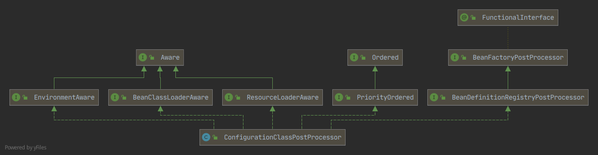
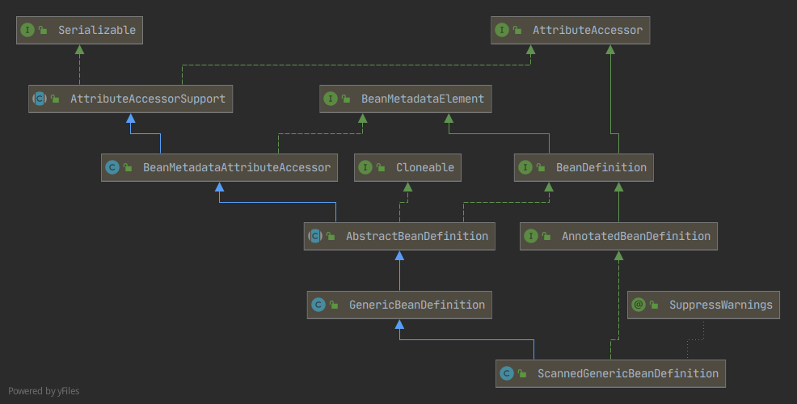

# Spring IOC 源码分析New

《Spring IOC 源码分析.md》内容不全，而且不直观，废弃。现在重新梳理一遍，主要是通过流程图的方式。

参考 graph/AnnotationConfigApplicationContext.drawio。

此markdown文件只是辅助看流程图的备注内容（因为有些内容不便在流程图中展示）。


## ConfigurationClassPostProcessor

这是IOC默认加载的的唯一一个BeanDefinitionRegistryPostProcessor类（虽然源码有看到４个实现类，但测试中默认只有这个有启用），UML:



**BeanFactoryPostProcessor主要用于对已有BeanDefinition属性进行添加或修改**。

**而BeanDefinitionRegistryPostProcessor侧重于在BeanFactoryPostProcessor之前添加更多BeanDefintion**。如下源码注释所说：

```
This allows for adding further bean definitions before the next post-processing phase kicks in.
```

分析源码BeanDefinitionRegistryPostProcessor在BeanFactoryPostProcessor之前执行。

这里我们分析下ConfigurationClassPostProcessor到底做了什么？主要分析它的`postProcessBeanDefinitionRegistry(BeanDefinitionRegistry registry)`方法。

１）遍历筛选候选配置类的BeanDefinition（筛选：Full模式、Lite模式，义面上是完整配置类、精简配置类），按Ordered接口方法的值排序；

２）创建配置类解析器，按类型解析;

测试用例中的配置类BeanDefinition类型：ScannedGenericBeanDefinition。




## BeanDefinition 各种类型的区别与作用

TODO

mergedBeanDefinitions的作用？


# NamedThreadLocal

