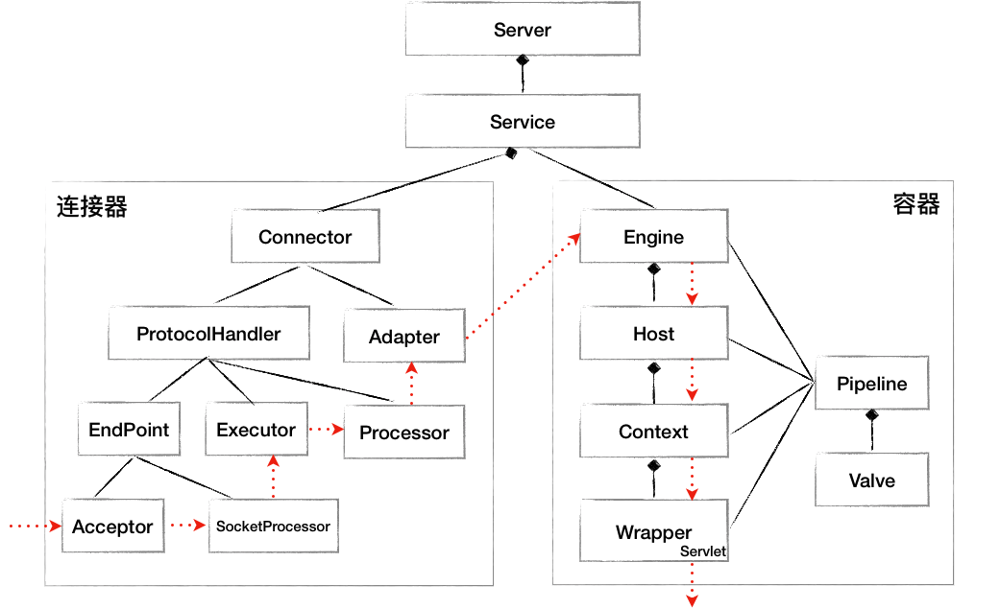

# Spring MVC 源码解析

这篇文档只是对流程图的补充。


## Tomcat 工作原理

贴两个图，介绍了Tomcat工作的核心原理：

连接器：


容器：


核心组件及请求在组件中流转过程：



Spring MVC 主要是对 Servlet 的细化，将Servlet拆分成前端控制器**DispatcherServlet**、处理器映射器**HandlerMapping**、处理器适配器**HandlerAdapter**、后端处理器**Controller**、视图解析器**ViewResolver**。

参考：[Tomcat 架构原理解析到架构设计借鉴](https://segmentfault.com/a/1190000023475177)


## Spring MVC 服务初始化


## Spring MVC 请求处理

### 先看下调用栈 

```verilog
sayHello:12, AnnotationBasedController (top.kwseeker.spring.mvc)
invoke0:-1, NativeMethodAccessorImpl (sun.reflect)
invoke:62, NativeMethodAccessorImpl (sun.reflect)
invoke:43, DelegatingMethodAccessorImpl (sun.reflect)
invoke:498, Method (java.lang.reflect)
doInvoke:205, InvocableHandlerMethod (org.springframework.web.method.support)
invokeForRequest:150, InvocableHandlerMethod (org.springframework.web.method.support)
invokeAndHandle:117, ServletInvocableHandlerMethod (org.springframework.web.servlet.mvc.method.annotation)
invokeHandlerMethod:895, RequestMappingHandlerAdapter (org.springframework.web.servlet.mvc.method.annotation)
handleInternal:808, RequestMappingHandlerAdapter (org.springframework.web.servlet.mvc.method.annotation)
handle:87, AbstractHandlerMethodAdapter (org.springframework.web.servlet.mvc.method)
doDispatch:1072, DispatcherServlet (org.springframework.web.servlet)
doService:965, DispatcherServlet (org.springframework.web.servlet)
processRequest:1006, FrameworkServlet (org.springframework.web.servlet)
doGet:898, FrameworkServlet (org.springframework.web.servlet)
service:634, HttpServlet (javax.servlet.http)
service:883, FrameworkServlet (org.springframework.web.servlet)

service:741, HttpServlet (javax.servlet.http)
internalDoFilter:231, ApplicationFilterChain (org.apache.catalina.core)
doFilter:166, ApplicationFilterChain (org.apache.catalina.core)
doFilter:52, WsFilter (org.apache.tomcat.websocket.server)
internalDoFilter:193, ApplicationFilterChain (org.apache.catalina.core)
doFilter:166, ApplicationFilterChain (org.apache.catalina.core)
invoke:199, StandardWrapperValve (org.apache.catalina.core)
invoke:96, StandardContextValve (org.apache.catalina.core)
invoke:543, AuthenticatorBase (org.apache.catalina.authenticator)
invoke:139, StandardHostValve (org.apache.catalina.core)
invoke:81, ErrorReportValve (org.apache.catalina.valves)
invoke:690, AbstractAccessLogValve (org.apache.catalina.valves)
invoke:87, StandardEngineValve (org.apache.catalina.core)
service:343, CoyoteAdapter (org.apache.catalina.connector)
service:615, Http11Processor (org.apache.coyote.http11)
process:65, AbstractProcessorLight (org.apache.coyote)
process:818, AbstractProtocol$ConnectionHandler (org.apache.coyote)
doRun:1627, NioEndpoint$SocketProcessor (org.apache.tomcat.util.net)
run:49, SocketProcessorBase (org.apache.tomcat.util.net)
runWorker:1149, ThreadPoolExecutor (java.util.concurrent)
run:624, ThreadPoolExecutor$Worker (java.util.concurrent)
run:61, TaskThread$WrappingRunnable (org.apache.tomcat.util.threads)
run:748, Thread (java.lang)
```

### 请求分发处理

#### 获取请求处理器对象（HandlerExecutionChain）

##### 查找处理器方法

依赖处理器映射注册器（MappingRegistry）进行查找与请求适配的处理器方法。

查找原理（两种）：

+ 请求路由 -> pathLookup 获取 RequestMappingInfo -> registry 获取MappingRegistration
+ MappingName -> nameLookup 获取 RequestMappingInfo -> registry 获取 MappingRegistration

数据结构：

```java
//RequestMappingInfo (即@RequestMpping定义的内容) -> MappingRegistration（
//	包含RequestMappingInfo、对应的处理器方法HandlerMethod、MappingName[可以理解为简写的处理器方法]）
private final Map<T, MappingRegistration<T>> registry = new HashMap<>();
//支持通过请求路由查找 RequestMappingInfo 对象
private final MultiValueMap<String, T> pathLookup = new LinkedMultiValueMap<>();
//支持通过MappingName查找 RequestMappingInfo 对象
private final Map<String, List<HandlerMethod>> nameLookup = new ConcurrentHashMap<>();
private final Map<HandlerMethod, CorsConfiguration> corsLookup = new ConcurrentHashMap<>();
private final ReentrantReadWriteLock readWriteLock = new ReentrantReadWriteLock();
```

测试的 MappingRegistry 内存数据：

```verilog
this.mappingRegistry = {AbstractHandlerMethodMapping$MappingRegistry@8354} 
 registry = {HashMap@8851}  size = 5
  {RequestMappingInfo@9540} "{ [/testParam3/{username}/{age}]}" -> {AbstractHandlerMethodMapping$MappingRegistration@9541} 
   key = {RequestMappingInfo@9540} "{ [/testParam3/{username}/{age}]}"
   value = {AbstractHandlerMethodMapping$MappingRegistration@9541} 
    mapping = {RequestMappingInfo@9540} "{ [/testParam3/{username}/{age}]}"
    handlerMethod = {HandlerMethod@9572} "top.kwseeker.spring.mvc.ParameterCaseController#testParam3(String, Integer)"
    directPaths = {Collections$EmptySet@9573}  size = 0
    mappingName = "PCC#testParam3"
    corsConfig = false
  {RequestMappingInfo@9542} "{ [/testParam4]}" -> {AbstractHandlerMethodMapping$MappingRegistration@9543} 
  {RequestMappingInfo@9544} "{ [/testParam1]}" -> {AbstractHandlerMethodMapping$MappingRegistration@9545} 
  {RequestMappingInfo@9546} "{ [/testParam2]}" -> {AbstractHandlerMethodMapping$MappingRegistration@9547} 
  {RequestMappingInfo@9531} "{ [/example/hello]}" -> {AbstractHandlerMethodMapping$MappingRegistration@9548} 
 pathLookup = {LinkedMultiValueMap@8852}  size = 4
  "/example/hello" -> {ArrayList@8849}  size = 1
   key = "/example/hello"
   value = {ArrayList@8849}  size = 1
    0 = {RequestMappingInfo@9531} "{ [/example/hello]}"
  "/testParam1" -> {ArrayList@9508}  size = 1
  "/testParam2" -> {ArrayList@9510}  size = 1
  "/testParam4" -> {ArrayList@9512}  size = 1
 nameLookup = {ConcurrentHashMap@8853}  size = 5
  "ABC#sayHello" -> {ArrayList@9521}  size = 1
   key = "ABC#sayHello"
   value = {ArrayList@9521}  size = 1
    0 = {HandlerMethod@4805} "top.kwseeker.spring.mvc.AnnotationBasedController#sayHello(String)"
  "PCC#testParam4" -> {ArrayList@9523}  size = 1
  "PCC#testParam1" -> {ArrayList@9525}  size = 1
  "PCC#testParam3" -> {ArrayList@9527}  size = 1
  "PCC#testParam2" -> {ArrayList@9529}  size = 1
 corsLookup = {ConcurrentHashMap@8854}  size = 0
 readWriteLock = {ReentrantReadWriteLock@8855} "java.util.concurrent.locks.ReentrantReadWriteLock@4b51759[Write locks = 0, Read locks = 1]"
 this$0 = {RequestMappingHandlerMapping@7362} 
```

##### @RequestMapping属性与匹配条件

**@RequestMapping属性**：

- **value (alias path)**: URL 路径，可以为数组。例如： `@RequestMapping(value = "/orders")` 或者 `@RequestMapping(value = {"/orders", "/billings"})`。
- **method**: 用于指定 HTTP 请求方法，可以是 GET、POST、PUT、DELETE 等，也可以是 RequestMethod 枚举的值。例如： `@RequestMapping(value = "/orders", method = RequestMethod.GET)`。
- **params**: 用于指定 HTTP 请求的参数，可以与参数值一起使用。例如：`@RequestMapping(value = "/orders", params = {"id=1", "type=book"})`。
- **headers**: 用于指定 HTTP 请求的 headers，可以与参数值一起使用。例如：`@RequestMapping(value = "/orders", headers = "api-version=1")`。
- **consumes**: 用于指定请求的 MIME 类型（Content-Type），例如：`@RequestMapping(value = "/orders", consumes = {"application/json", "application/xml"})`。
- **produces**: 用于指定返回值可接受的 MIME 类型（Accept），例如：`@RequestMapping(value = "/orders", produces = {"application/json", "application/xml"})`。

**getHandler() 过程中的匹配条件**：

对应  RequestMappingInfo 类的属性，用作查询与请求适配的Handler方法时进行过滤。

```java
private final String name;
private final PathPatternsRequestCondition pathPatternsCondition;
//路由匹配规则(Set集合)， 如：[/rb/user]
private final PatternsRequestCondition patternsCondition;
//HTTP请求类型匹配规则，如：GET
private final RequestMethodsRequestCondition methodsCondition;
private final ParamsRequestCondition paramsCondition;
private final HeadersRequestCondition headersCondition;
private final ConsumesRequestCondition consumesCondition;
private final ProducesRequestCondition producesCondition;
private final RequestConditionHolder customConditionHolder;
```

##### 最终获取的处理器对象

即HandlerExecutionChain对象，

```verilog
mappedHandler = {HandlerExecutionChain@10182} "HandlerExecutionChain with [top.kwseeker.spring.mvc.AnnotationBasedController#sayHello(String)] and 2 interceptors"
 handler = {HandlerMethod@10156} "top.kwseeker.spring.mvc.AnnotationBasedController#sayHello(String)"
  bean = {AnnotationBasedController@4679} 
  beanFactory = {DefaultListableBeanFactory@4802} "org.springframework.beans.factory.support.DefaultListableBeanFactory@47552116: defining beans [annotationBasedController,parameterCaseController,org.springframework.context.annotation.internalConfigurationAnnotationProcessor,org.springframework.context.annotation.internalAutowiredAnnotationProcessor,org.springframework.context.annotation.internalCommonAnnotationProcessor,org.springframework.context.event.internalEventListenerProcessor,org.springframework.context.event.internalEventListenerFactory,mvcContentNegotiationManager,org.springframework.web.servlet.mvc.method.annotation.RequestMappingHandlerMapping,mvcCorsConfigurations,org.springframework.format.support.FormattingConversionServiceFactoryBean#0,org.springframework.web.servlet.mvc.method.annotation.RequestMappingHandlerAdapter,mvcUriComponentsContributor,org.springframework.web.servlet.handler.MappedInterceptor#0,org.springframework.web.servlet.mvc.method.annotation.ExceptionHandlerExceptionResolver#0,org.springframework.web.ser"
  messageSource = {XmlWebApplicationContext@4724} "WebApplicationContext for namespace 'dispatcherServlet-servlet', started on Thu May 25 14:31:40 CST 2023"
  beanType = {Class@3329} "class top.kwseeker.spring.mvc.AnnotationBasedController"
  method = {Method@4684} "public java.lang.String top.kwseeker.spring.mvc.AnnotationBasedController.sayHello(java.lang.String)"
  bridgedMethod = {Method@4684} "public java.lang.String top.kwseeker.spring.mvc.AnnotationBasedController.sayHello(java.lang.String)"
  parameters = {MethodParameter[1]@4803} 
  responseStatus = null
  responseStatusReason = null
  resolvedFromHandlerMethod = {HandlerMethod@4805} "top.kwseeker.spring.mvc.AnnotationBasedController#sayHello(String)"
  interfaceParameterAnnotations = null
  description = "top.kwseeker.spring.mvc.AnnotationBasedController#sayHello(String)"
 interceptorList = {ArrayList@10224}  size = 2
  0 = {ConversionServiceExposingInterceptor@10226} 
  1 = {ResourceUrlProviderExposingInterceptor@10227} 
 interceptorIndex = -1
```

