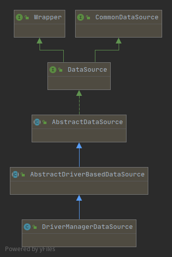

# Spring事务源码解析

此文档只是流程图（SpringTransaction.drawio）的批注。


## DriverManagerDataSource

此类位于spring-jdbc。




## TransactionTemplate

此类位于spring-tx。


## 事务传播类型

+ MANDATORY：外部存在事务就将当前操作融合到外部事务，外部不存在事务就抛异常；
+ REQUIRED（默认）：外部存在事务就将当前操作融合到外部事务，外部不存在事务就新建事务；
+ REQUIRES_NEW：外部存在事务就将外部事务先挂起，然后创建新事务，外部不存在事务直接创建新事务；
+ NESTED：外部存在事务就将当前操作融合到外部事务，SavePoint外层影响内层内层不影响外层，外部不存在事务直接创建新事务；
+ SUPPORTS: 外部存在事务就将当前操作融合到外部事务，外部不存在事务也不创建新事务；
+ NOT_SUPPORTED: 外部存在事务就将外部事务挂起，外部不存在事务也不创建新事务；
+ NEVER: 外部存在事务就抛异常，外部不存在事务也不创建新事务；


## TransactionSynchronization 事务同步器

```java
public interface TransactionSynchronization extends Flushable {

	int STATUS_COMMITTED = 0;
	int STATUS_ROLLED_BACK = 1;
	int STATUS_UNKNOWN = 2;

	// 事务挂起的时候调用此方法（准确说是在事务线程本地资源释放的前一步）
	// 看源码事务挂起是主要是释放TransactionSynchronizationManager中的NamedTheadLocal资源
    //，即释放线程本地事务资源（流程图中橙黄色部分），详细参考 AbstractPlatformTransactionManager#suspend()
	// TransactionSynchronizationManager#unbindResource
	default void suspend() {
	}
    
	// 事务恢复时候调用
    // 即重新绑定事务线程本地资源的时候执行
	// TransactionSynchronizationManager#bindResource
	default void resume() {
	}

	// 将基础会话刷新到数据存储区（如果适用） 比如Hibernate/Jpa的session
	@Override
	default void flush() {
	}

	// 在事务提交之前触发。在AbstractPlatformTransactionManager.processCommit方法里 commit之前触发
	// 事务提交之前，比如flushing SQL statements to the database
	// 请注意：若此处发生了异常，会导致回滚
	default void beforeCommit(boolean readOnly) {
	}
	// 在beforeCommit之后，在commit/rollback之前执行
	// 它和beforeCommit还有个非常大的区别是：即使beforeCommit抛出异常了  这个也会执行
	default void beforeCompletion() {
	}

	// 这个就非常重要了，它是事务提交（注意事务已经成功提交，数据库已经持久化完成这条数据了）后执行  
    // 注意此处是成功提交而没有异常
	// javadoc说了：此处一般可以发短信或者email等操作,因为事务已经成功提交了
	// =====但是但是但是：======
	// 事务虽然已经提交，但事务资源（链接connection）可能仍然是活动的和可访问的。
	// 因此，此时触发的任何数据访问代码仍将“参与”原始事务 允许执行一些清理（不再执行提交操作！）
	// 除非它明确声明它需要在单独的事务中运行。
	default void afterCommit() {
	}

	// 和上面的区别在于：即使抛出异常回滚了  它也会执行的。它的notice同上
	default void afterCompletion(int status) {
	}
}
```


## 关于只读事务

### 配置事务为只读

```java
 <tx:method name="search*" read-only="true" /> 
 @Transactional(readOnly = true)
 transactionTemplate.setReadOnly(true);	//对应读写事务：SET GLOBAL TRANSACTION READ WRITE;
```

看源码（参考流程图）可以看到就是执行了

```java
stmt.executeUpdate("SET TRANSACTION READ ONLY");
```

使用 START TRANSACTION READ ONLY 语句启动只读事务。在这种情况下，尝试对数据库（对于 InnoDB、MyISAM 或其他类型的表）进行更改会导致错误。不过仍然可以在只读事务中更改特定于会话的临时表，或发出锁定查询，因为这些更改和锁定对任何其他事务都不可见。

可以用来优化InnoDB表上查询事务创建的效率，并可以提供非锁定查询的性能。

只读事务对比于读写事务只是执行效率上的优化。

实际中**使用只读事务更多的是强调“事务”而不是“只读”**，比如有些场景，希望多次查询过程中不要受到第三方事务更新影响，就可以为这个“多次查询”添加上只读事务（添加读写事务也是可以的，不过只是查询为何不用性能更好的只读事务呢）。参考测试Demo: SpringReadOnlyTransactionExample。


## 事务失效问题

+ **事务应用在非public方法上**

  `TransactionInterceptor` （事务拦截器）在目标方法执行前后进行拦截,`DynamicAdvisedInterceptor`（CglibAopProxy 的内部类）的 intercept 方法或 `JdkDynamicAopProxy` 的 invoke 方法会间接调用 `AbstractFallbackTransactionAttributeSource`的 `computeTransactionAttribute` 方法，获取Transactional 注解的事务配置信息。

  ```java
  protected TransactionAttribute computeTransactionAttribute(Method method,
      Class<?> targetClass) {
          // Don't allow no-public methods as required.
          if (allowPublicMethodsOnly() && !Modifier.isPublic(method.getModifiers())) {
          return null;
          }
  }
  ```

+ **数据库本身不支持事务**

  如果MySQL配置使用表锁，事务同样会失效（MySQL事务是针对行锁的）

+ **方法内部调用同一个类中其他＠Transactial修饰的方法导致事务失效**

  以外部方法为准，即使内部调了一个@Transactional方法，但是生成代理类的时候并不会为外部方法添加事务控制增强。

  解决方法:

  1) 在没有@Transactional的方法上添加事务，然后另一个方法会使用当前方法的代理对象；

  2) 当前方法不加事务注解，手动获取当前类的代理对象，通过代理对象调用另一个方法。

+ **异常在事务方法中被捕获**

+ **配置不正确**

  + 标签`<tx:advice>`中切点配置不正确

  + 异常配置不正确

    比如配置rollbackFor针对某个异常才回滚，那么其他的异常事务都失效。

